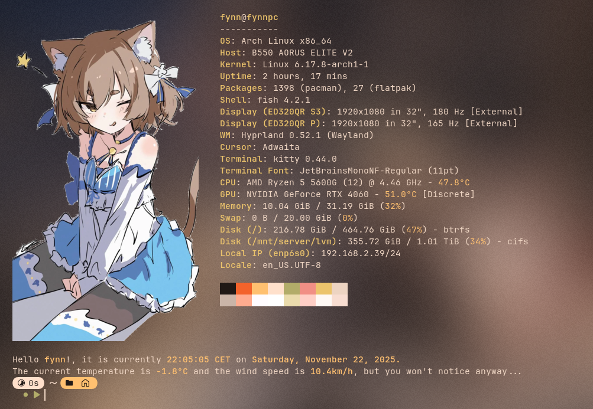

# dots
> [!NOTE]
> This just serves as a repo for my dotfiles (mainly so I can use them in school)  
> I'll probably not update this often...

# Preview

# Dependencies
- neovim
- fish
- fastfetch
- kitty
- jq (when using the weather function in the greet script)
