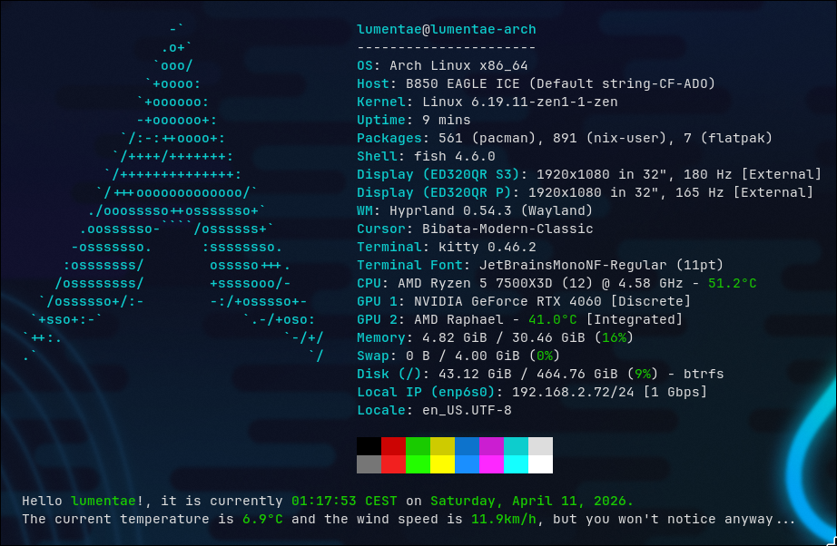

# dots
> [!NOTE] 
> Updates should be more frequent now that I'm using [NixOS](https://nixos.org/)

# Preview

# Dependencies
- neovim
- fish
- fastfetch
- kitty
- jq (when using the weather function in the greet script)
